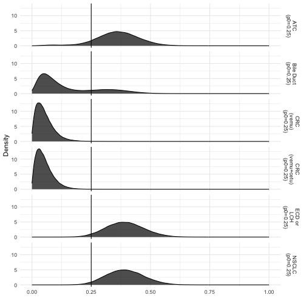

<!-- README.md is generated from README.Rmd. Please edit that file -->

# basket

<!-- badges: start -->

[](https://cran.r-project.org/package=basket)
[](https://www.tidyverse.org/lifecycle/#maturing)
[](https://travis-ci.org/kaneplusplus/basket)
[](https://ci.appveyor.com/project/kaneplusplus/basket/branch/master)
[](https://codecov.io/github/kaneplusplus/basket?branch=master)
<!-- badges: end -->

Basket designs are prospective clinical trials that are devised with the
hypothesis that the presence of selected molecular features determine a
patient’s subsequent response to a particular “targeted” treatment
strategy. Basket trials are designed to enroll multiple clinical
subpopulations to which it is assumed that the therapy in question
offers beneficial efficacy in the presence of the targeted molecular
profile. The treatment, however, may not offer acceptable efficacy to
all subpopulations enrolled. Moreover, for rare disease settings, such
as oncology wherein these trials have become popular, marginal measures
of statistical evidence are difficult to interpret for sparsely enrolled
subpopulations. Consequently, basket trials pose challenges to the
traditional paradigm for trial design, which assumes inter-patient
exchangeability. The R-package `basket` facilitates the analysis of
basket trials by implementing multi-source exchangeability models. By
evaluating all possible pairwise exchangeability relationships, this
hierarchical modeling framework facilitates Bayesian posterior shrinkage
among a collection of discrete and pre-specified subpopulations.

## Installation

You can install the released version of basket from
[CRAN](https://CRAN.R-project.org) with:

``` r
install.packages("basket")
```

And the development version from [GitHub](https://github.com/) with:

``` r
# install.packages("devtools")
devtools::install_github("kaneplusplus/basket")
```

## Example

The [“Vemurafenib in multiple nonmelanoma cancers with BRAF V600
mutations”](https://doi.org/10.1200/JCO.2016.69.9751) study enrolled
patients into predetermined baskets that were determined by organ site
with primary end point defined by Response Evaluation Criteria in Solid
Tumors (RECIST), version 1.1 or the criteria of the International
Myeloma Working Group (IMWG). Statistical evidence for preliminary
clinical efficacy was obtained through estimation of the organ-specific
objective response rates at 8 weeks following the initiation of
treatment. This section demonstrates the implementation of  through
analysis of six organs comprising non–small-cell lung cancer (NSCLC),
cholangiocarcinoma (Bile Duct), Erdheim–Chester disease or
Langerhans’-cell histiocytosis (ECD or LCH), anaplastic thyroid cancer
(ATC), and colorectal cancer (CRC) which formed two cohorts. Patients
with CRC were initially administered vemurafenib. The study was later
amended to evaluate vemurafenib in combination with cetuximab for CRC
which comprised a new basket. Observed outcomes are summarized below.
Included in the  package, the dataset is accessible in short `vemu_wide`
as well as long formats `vemu`.

``` r
library(basket)
data(vemu_wide)
vemu_wide
#> # A tibble: 6 x 7
#>   baskets enrolled evaluable responders one_or_fewer_pr… two_prior_thera…
#>   <chr>      <dbl>     <dbl>      <dbl>            <dbl>            <dbl>
#> 1 NSCLC         20        19          8               11                4
#> 2 CRC (v…       10        10          0                1                2
#> 3 CRC (v…       27        26          1                5               11
#> 4 Bile D…        8         8          1                2                1
#> 5 ECD or…       18        14          6                9                7
#> 6 ATC            7         7          2                5                1
#> # … with 1 more variable: three_or_more_therapies <dbl>
```

Inspection of Table  reveals heterogeneity among the studied baskets.
CRC (vemu), CRC (vemu+cetu), and Bile Duct had relatively low response
rates when compared to other baskets, suggesting that patients
presenting the BRAF V600 mutation may not yield exchangeable information
for statistical characterization of the effectiveness of the targeted
therapy. Therefore, the MEM framework is implemented to measure the
extent of basketwise heterogeneity and evaluate the effectiveness of the
targeted therapy on the basis of its resultant multi-resolution smoothed
posterior distributions. This case study reports posterior probabilities
evaluating the evidence that the response probability for each
organ-site exceeds the null rate of `p0 = 0.25`.

An analysis of the trial data can be reproduced by loading the
`vemu_wide` data, which is included with the package. The data set
includes the number of evaluable patients (column `evaluable`), the
number of responding patients (column `responders`), and the associated
baskets for the respective results (column `baskets`). The model is fit
by passing these values to the `basket()` function along with an
argument specifying the null response rate of 0.25 for evaluation of
each basket. A visualization of the posterior distribution of the
response rates can be created with the following and shows that the Bile
Duct and CRC cohorts are similar and do not respond to treatment where
ATC, ECD or LCH, and NSCLC do respond.

``` r
data(vemu_wide)
vm <- basket(vemu_wide$responders, vemu_wide$evaluable,
vemu_wide$baskets, p0 = 0.25)
plot_density(vm, type = "basket")
```



### Code of conduct

Please note that this project is released with a [Contributor Code of
Conduct](CONDUCT.md). By participating in this project you agree to
abide by its terms.
